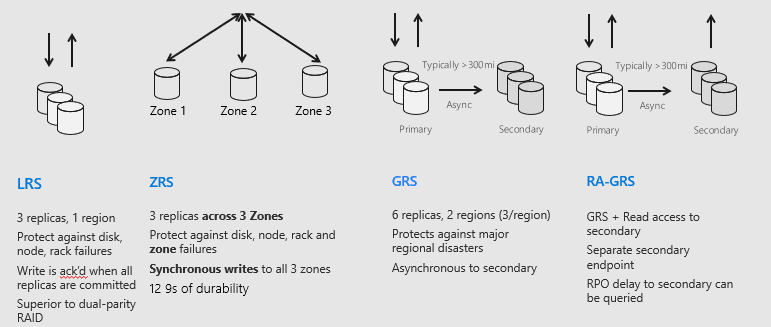

# Blob Storage

A container where you can dump all files. Unorginised. 

A resource group contains a storage account which contains containers which contains blobs.

Redundancy - back up copies in case thing fail and you can fall back on them.

Can make blobs on azure portal or azure cli or azure powershell. We use azure powershell.

`az` Every command starts with this in Azure cli

`az login` -> Takes you to a browers to log in and give back a JSON array which shows your information. **Do NOT put this on github!**

This command creates the storage account. If it has worked you get a large object:
    az storage account create --name tech241elenastorage --resource-group tech241 --location uksouth --sku Standard_LRS
    
    # Lists all of the storage accounts for the resource group
    az storage account list --resource-group tech241

    # Choose which bits you want to display
    az storage account list --resource-group tech241 --query "[].{Name:name, Location:location, Kind:kind}" --output table

    # Make a container
    az storage container create --account-name tech241elenastorage --name testcontainer

    # Upload a blob to a container

    touch test.txt # Create an empty file
    nano test.txt # Put in a line just to make it not empty

    az storage blob upload \ 
    --account-name tech241elenastorage \ --container-name testcontainer \ 
    --name newname.txt \ 
    --file test.txt \ 
    --auth-mode login

    # Check if the blob is in the container

    az storage blob list \
    --account-name tech241elenastorage \
    --container-name testcontainer \
    --output table \
    --suth-mode login

To make it privite go into storage account on azure portal. Then containers and click on the test container. Within there will ba a file called newname.txt. Click on it and it has the url.

The url is private and shows that it doesnt exist even though it does to prevent hackers.

To stop this you can change the access level.

## Types of redundancy

